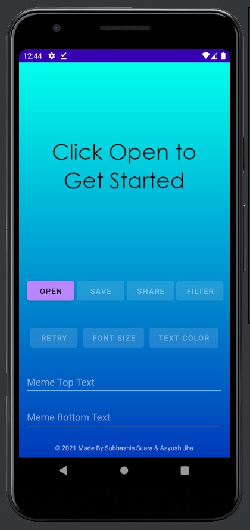

# Memeistic

A meme maker app made for android.

Created by Subhashis Suara & Aayush Jha

# Features

- Open meme template from gallery or capture photo using the camera
- Add top and bottom meme text
- Move top and bottom meme text position by dragging
- Change top and bottom meme text color
- Change top and bottom meme text font size
- Add color filters
- Save & Share the meme

# Screenshots

## App Icon

## Splash Screen

## Initial Screen

## Open Screen

## Edit Screen

## Meme Text

## Font Color

## Copyright Text & Share Button (After Saving the Meme)

